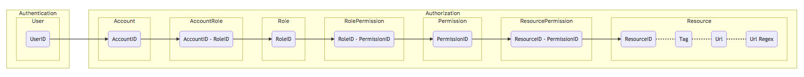

# Granica

* User authentication and authorization microservice.
* API Gateway.

**This is a work in progress in its initial stage**


# Overview (draft)
[](docs/overview.md)

[To be completed]


## Install
[To be completed]


## Tests
### Integration
```shell
$ go test gitlab.com/mikrowezel/backend/granica/pkg/test
```

### REST curl
```shell
$ resources/rest/sign-up.sh
```

**Output**
```shell
level=info message="Granica authentication logger started."
level=info message="Config Logger started."
level=info message="MongoDB: Connected!"
level=debug req="Req: {Username:username Password:password Email:username@granica.dev EmailConfirmation:username@granica.dev Tenant:localhost}"
level=info method=SignUp input="{username, password, username@granica.dev, username@granica.dev, localhost}" output=null err=null took=4.256µs
```


## Built With

* [Go kit](https://github.com/go-kit/kit)


## License
This project is licensed under the MIT License - see the [LICENSE.md](https://opensource.org/licenses/MIT) file for details.